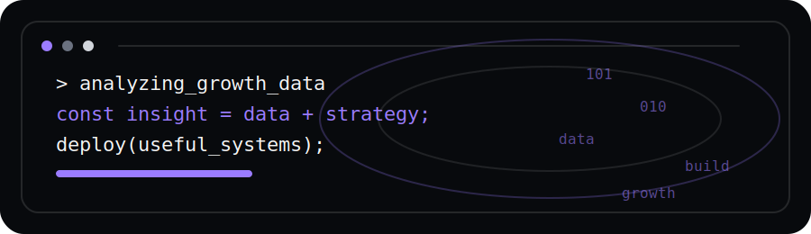

  

  

  

  
  &nbsp;&nbsp;
  
  &nbsp;&nbsp;
  

  
  
  
  

  

  

  Hi! I'm <b>Afreen</b>. 
  I enjoy solving problems with code, analyzing data to uncover insights, and designing products that are simple, useful, and meaningful. 
  I believe good software should make life easier, not more complicated.

  

  

<table align="center">
  <tr>
    <td align="center" width="33%">
      <h3>📈 Data Analytics</h3>
      
Turning data into decisions.

    </td>
    <td align="center" width="33%">
      <h3>💻 Software</h3>
      
Desktop apps, automation and clean systems.

    </td>
    <td align="center" width="33%">
      <h3>🎯 Marketing</h3>
      
Research, positioning and growth.

    </td>
  </tr>
</table>

  

  

<table align="center">
  <tr>
    <td align="center" width="25%">
      <h3>📒 Notes Merger</h3>
      
Desktop application

    </td>
    <td align="center" width="25%">
      <h3>📊 Sales Dashboard</h3>
      
Python Analytics

    </td>
    <td align="center" width="25%">
      <h3>🌐 Portfolio Website</h3>
      
React

    </td>
    <td align="center" width="25%">
      <h3>🤖 AI Assistant</h3>
      
OpenAI API

    </td>
  </tr>
</table>

  

  

  <code>Python</code>
  <code>JavaScript</code>
  <code>React</code>
  <code>Rust</code>
  <code>Tauri</code>
  <code>Data Analytics</code>
  <code>Marketing Strategy</code>
  <code>GitHub</code>

  

  
  

  

  

  

  <b>Building useful, simple systems with a little strategy and a lot of care.</b>

