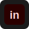

	

	

---

## About

I am **Afreen Tahir** — a Business Development professional with a BS in Business Data Analytics. I blend marketing and growth strategy with technical skills in Python and C++ to build data-informed solutions and drive measurable impact.

## Skills

- 🕷️ Business development
- 🕸️ Marketing strategy
- 🧮 Python (data analysis, automation)
- 💻 C++ (software development)

## Contact

-

	<table>
		<tr>
			<td align="center" style="padding:12px; border:2px solid #2a0000; background:#080404; border-radius:12px">
				
			</td>
			<td style="width:18px"></td>
			<td style="padding-left:6px; vertical-align:middle">
				<strong style="color:#ffdede">Contact</strong>
				

					<a href="mailto:afreentahir938@gmail.com" style="text-decoration:none">
						
						afreentahir938@gmail.com
					</a>
				

				

					<a href="https://www.linkedin.com/in/afreen-tahir-989483404/" target="_blank" rel="noopener" style="text-decoration:none">
						
						LinkedIn / Afreen Tahir
					</a>
				

			</td>
		</tr>
	</table>

---

Fancy this look? I can:

- Replace the GIF with one you prefer.
- Add a custom banner SVG for a stronger maroon/black Spidey aesthetic.
- Commit & push to a repo if you provide remote details.

